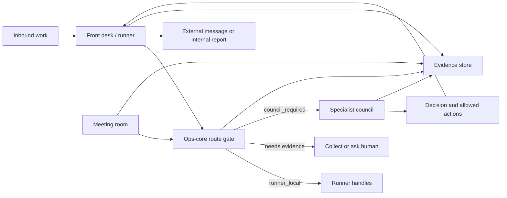

# V-Board

**Your entire ops team, automated.**

V-Board is an open-source AI operations stack for routing business work, coordinating specialist AI departments, producing evidence-backed decisions, and keeping humans in control of the actions that matter.

It is built for teams that want an AI front desk, CFO, CTO, legal reviewer, sales operator, meeting advisor, and back-office analyst without letting an agent blindly spend tokens, send messages, or mutate records.

## What It Does

- Routes work before any model call, using deterministic rules and evidence checks.
- Delegates hard questions to a council of specialist workers.
- Keeps outbound communication in the runner/front-desk layer.
- Blocks unsafe or under-evidenced work instead of hallucinating.
- Produces durable work orders, decisions, transcripts, commitments, and audit logs.
- Runs a live meeting-room service where AI advisors can listen, intervene, escalate, and preserve evidence.
- Supports bring-your-own-provider keys for LLMs, speech-to-text, voice, avatars, and bank data.

## The Core Promise

V-Board does not try to be one magic chatbot. It behaves like an operating team:

1. Front desk receives the request.
2. Ops core classifies it and checks evidence.
3. Council prepares specialist analysis when needed.
4. Runner executes only allowed actions.
5. Evidence is written so humans can audit the result.

The main invariant is simple: **the council prepares, the runner communicates.**

## Quick Start

```bash
npm install
npm test --workspaces --if-present
```

Run the no-key meeting-room demo:

```bash
python -m pip install -r packages/meeting-room/requirements.txt pytest
python packages/meeting-room/scripts/demo_meeting_room.py
```

The demo creates a temporary meeting, adds CFO and Legal advisors, captures a transcript commitment, triggers a high-risk intervention, pauses for host approval, resumes with context, and prints the evidence directory.

## Docker Start

```bash
cp .env.example .env
# Fill at least VBOARD_COUNCIL_TOKEN and VBOARD_API_TOKEN for protected services.
docker compose up -d --build
curl http://127.0.0.1:8788/health
```

Optional local model profile:

```bash
docker compose --profile ollama up -d
```

## Packages

| Package | Role |
|---|---|
| `packages/ops-core` | Routing gate, HTTP API, MCP tools, work orders, finance/CFO stack, observability. |
| `packages/council` | Specialist AI council, model routing, cost guard, safety gates, department workflows. |
| `packages/runner` | Cron jobs, evidence collection, report rendering, outbound delivery, quality gates. |
| `packages/meeting-room` | FastAPI meeting advisor with transcript memory, intervention logic, escalation gates, voice/avatar hooks. |
| `front-desk` | Public-facing operator policies and communication modules. |
| `back-office` | Infrastructure, diagnostics, server, cost, and hard technical operations policies. |

## Architecture



## Contracts That Matter

- **Route decision**: every task gets a category, urgency, temperature, ownership state, and allowed next step.
- **Work order**: every non-trivial task becomes a durable unit of work with status, owner, department, and evidence links.
- **Evidence record**: reports separate empirical facts from estimates with `[EMP]` and `[EST]` tags.
- **Council output**: council may recommend, object, and summarize, but it cannot send external messages.
- **Meeting event**: transcripts, decisions, commitments, escalations, avatar sessions, and generated audio are logged per room.
- **Provider adapter**: provider-specific secrets and SDKs stay at the adapter edge, not in the product core.

See [`docs/ARCHITECTURE.md`](docs/ARCHITECTURE.md), [`docs/CONTRACTS.md`](docs/CONTRACTS.md), and [`docs/PROVIDER_ADAPTERS.md`](docs/PROVIDER_ADAPTERS.md).

## Meeting Room

The meeting room is the flagship interactive path:

1. A room is created with active advisors such as CFO, CTO, COO, Legal, Product, or CRM.
2. Human transcript or audio enters the room.
3. The advisor council checks whether intervention is useful.
4. Risky, legal, or high-urgency interventions pause for host approval.
5. Approved interventions resume with context and are written to the transcript.
6. Evidence is stored under `VBOARD_DATA_ROOT/meetings/<date>/<room_id>/`.

See [`docs/MEETING_ROOM.md`](docs/MEETING_ROOM.md).

## Provider Model

Core code is provider-neutral. Operators can wire their own:

| Capability | Generic env |
|---|---|
| Primary LLM | `PRIMARY_LLM_API_KEY`, `PRIMARY_LLM_API_BASE_URL` |
| Reviewer LLM | `REVIEWER_LLM_API_KEY`, `REVIEWER_LLM_API_BASE_URL` |
| Chair LLM | `CHAIR_LLM_API_KEY`, `CHAIR_LLM_API_BASE_URL` |
| LLM router | `LLM_ROUTER_API_KEY`, `LLM_ROUTER_API_BASE_URL` |
| Speech-to-text | `STT_API_KEY`, `STT_SDK_MODULE`, `STT_SDK_CLIENT` |
| Voice | `VOICE_API_KEY`, `VOICE_API_BASE_URL`, `VOICE_API_KEY_HEADER` |
| Avatar | `AVATAR_API_KEY`, `AVATAR_API_BASE_URL` |
| Bank data | `BANK_API_AUTH` or `BANK_API_LOGIN` / `BANK_API_SECRET` |

## Security Invariants

- Protected services require bearer tokens in production.
- Meeting-room containers bind to localhost by default.
- File reads and writes are scoped under configured data roots.
- Provider keys are never written to evidence logs.
- The council cannot send email, chat, CRM updates, payments, filings, or legal commitments.
- The CFO stack fails closed when bank validation is missing or inconsistent.
- CI scans for hardcoded secrets, phone numbers, private server IPs, and unsafe council send permissions.

See [`SECURITY.md`](SECURITY.md) and [`docs/meeting-room-security.md`](docs/meeting-room-security.md).

## Development

```bash
npm install
npm test --workspaces --if-present
npm run demo:meeting
```

Meeting-room tests:

```bash
python -m pip install -r packages/meeting-room/requirements.txt pytest
python -m pytest packages/meeting-room/tests -q
```

Syntax and guardrails used during verification:

```bash
node packages/council/scripts/check_all.js
node packages/ops-core/tests/run.js
python packages/meeting-room/scripts/check_meeting_room_security.py
```

## Status

This repository is being prepared as a serious open-source automation framework. The next milestones are:

- Stable JSON schemas for route decisions, work orders, evidence, and meeting events.
- More provider adapter examples outside the core.
- One-command Docker demo with seeded fixtures.
- Release tags, changelog, and issue templates.
- Operator dashboard for model usage, cost, blocked work, and evidence trails.

## License

MIT. See [`LICENSE`](LICENSE).