<div align="center">

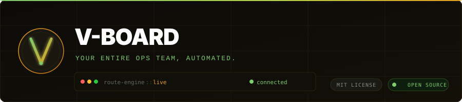

<br/>

[](LICENSE)
[](package.json)
[](packages/meeting-room/requirements.txt)
[](docker-compose.yml)
[](https://github.com/jobboat-fr/V-board/actions)

</div>

---

V-Board is an open-source AI operations stack for routing business work, coordinating specialist AI departments, producing evidence-backed decisions, and keeping humans in control of the actions that matter.

Built for teams that want an AI front desk, CFO, CTO, legal reviewer, sales operator, meeting advisor, and back-office analyst - without letting an agent blindly spend tokens, send messages, or mutate records.

## What It Does

- Routes work before any model call, using deterministic rules and evidence checks.
- Delegates hard questions to a council of specialist workers.
- Keeps outbound communication in the runner/front-desk layer.
- Blocks unsafe or under-evidenced work instead of hallucinating.
- Produces durable work orders, decisions, transcripts, commitments, and audit logs.
- Runs a live meeting-room service where AI advisors can listen, intervene, escalate, and preserve evidence.
- Supports bring-your-own-provider keys for LLMs, speech-to-text, voice, avatars, and bank data.

## The Core Promise

V-Board does not try to be one magic chatbot. It behaves like an operating team:

1. Front desk receives the request.
2. Ops core classifies it and checks evidence.
3. Council prepares specialist analysis when needed.
4. Runner executes only allowed actions.
5. Evidence is written so humans can audit the result.

The main invariant is simple: **the council prepares, the runner communicates.**

## Prerequisites — Hermes Agent (required on every server)

V-Board does not ship its own message gateway, LLM router, cron execution engine, or channel delivery layer. All of that runs through **[Hermes Agent](https://github.com/NousResearch/hermes-agent)**, which must be installed on every machine or container that runs ops-core, council, or runner.

Every runner cron job, every outbound WhatsApp/Telegram notification, every inbox fetch, and every model call fallback calls the `agent_runtime` CLI binary — which is Hermes. Without it the containers start but nothing executes.

```bash
# Install on each server / inside each container
curl -fsSL https://raw.githubusercontent.com/NousResearch/hermes-agent/main/scripts/install.sh | bash
source ~/.bashrc

# V-Board calls the binary as "agent_runtime" — create the alias
ln -sf "$(which hermes)" /usr/local/bin/agent_runtime

# Verify
agent_runtime status
```

If you are migrating from OpenClaw:

```bash
hermes claw migrate
```

See [`docs/AGENT_RUNTIME.md`](docs/AGENT_RUNTIME.md) for per-container Dockerfile setup, workspace layout, cron job registration, environment variables, and OpenClaw migration.

---

## Quick Start

```bash
npm install
npm test --workspaces --if-present
```

Run the no-key meeting-room demo:

```bash
python -m pip install -r packages/meeting-room/requirements.txt pytest
python packages/meeting-room/scripts/demo_meeting_room.py
```

The demo creates a temporary meeting, adds CFO and Legal advisors, captures a transcript commitment, triggers a high-risk intervention, pauses for host approval, resumes with context, and prints the evidence directory.

## Docker Start

```bash
cp .env.example .env
# Fill at least VBOARD_COUNCIL_TOKEN and VBOARD_API_TOKEN for protected services.
docker compose up -d --build
curl http://127.0.0.1:8788/health
```

Optional local model profile:

```bash
docker compose --profile ollama up -d
```

## Packages

| Package | Role |
|---|---|
| `packages/ops-core` | Routing gate, HTTP API, MCP tools, work orders, finance/CFO stack, observability. |
| `packages/council` | Specialist AI council, model routing, cost guard, safety gates, department workflows. |
| `packages/runner` | Cron jobs, evidence collection, report rendering, outbound delivery, quality gates. |
| `packages/meeting-room` | FastAPI meeting advisor with transcript memory, intervention logic, escalation gates, voice/avatar hooks. |
| `front-desk` | Public-facing operator policies and communication modules. |
| `back-office` | Infrastructure, diagnostics, server, cost, and hard technical operations policies. |

## Architecture

Each diagram covers one flow independently. Read them in order for the full system picture, or jump to the one relevant to what you are building.

### Request Entry — 8-Step Routing Pipeline

Every `POST /route` runs this fixed sequence. Steps 1, 2, 3, 5, 6, 7 are deterministic — zero LLM cost.

```mermaid
flowchart LR
    IN([POST /route]) --> P1["① TaskRouter.classify\nkeyword · urgency P0–P3\nrestriction flags"]
    P1 --> P2["② CostGuard.evaluate\ndaily + monthly budget\nnormal / cheap / stop"]
    P2 --> P3["③ buildWorkflow\nD_fast score · mail policy\nlead structuring"]
    P3 --> P4["④ applyKitchenWorkers\nparallel mail classifier\nhot / warm / cold / spam"]
    P4 --> P5["⑤ evaluateDealRoom\n0–100 deal score\ncaptain at 82 · pass at 92"]
    P5 --> P6["⑥ enforceSafetyGates\n× 10 enforced\nany hit → block + owner notify"]
    P6 --> P7["⑦ buildWorkOrder\nL1 DRAFT → L4 HARD_BLOCK\ndurable unit of work"]
    P7 --> P8["⑧ CouncilRuntime.run\nmodel call · judge decision\nevidence write"]
    P8 --> EV[(Evidence store)]
```

### Mail Triage — Inbound Email Classification

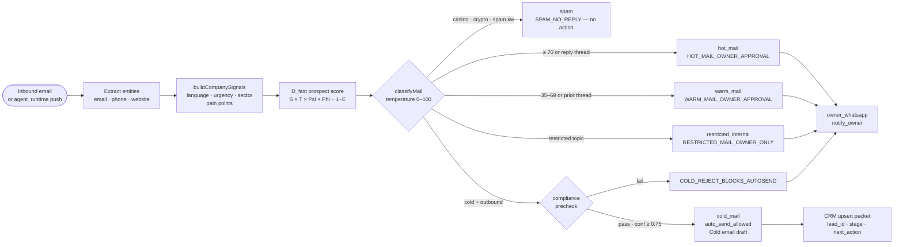

### Lead Scout — Prospect Scoring and Outreach Preparation

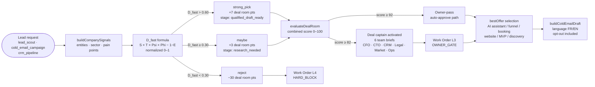

### Deal Room — High-Value Deal Activation

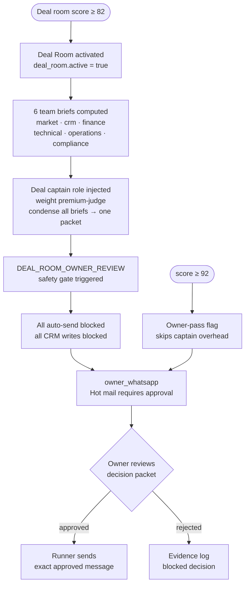

### Safety Gate Enforcement — All 10 Gates

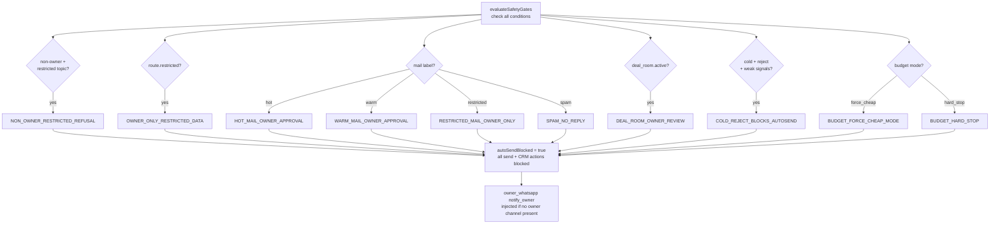

### Work Order Lifecycle — L1 to L4

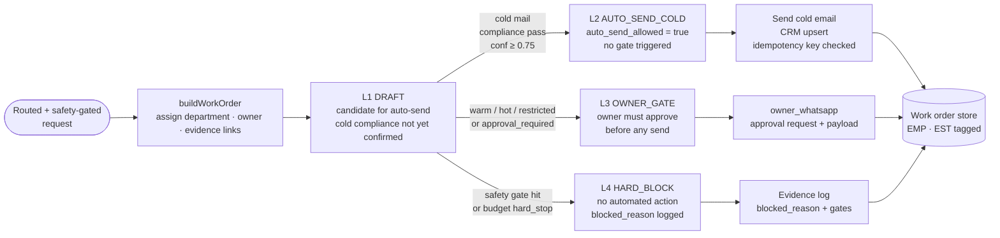

### AI Council Consensus — AIWorkerCollective 5-Stage

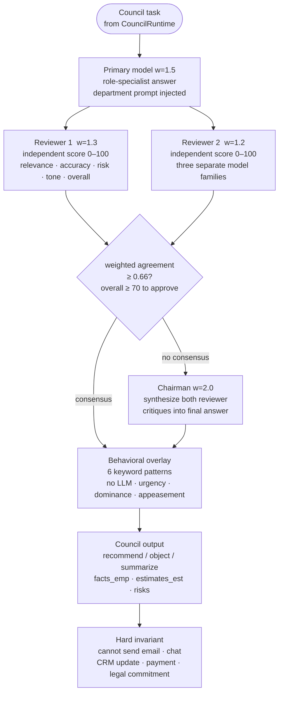

### Meeting Room Intervention — 3-Guard Chain

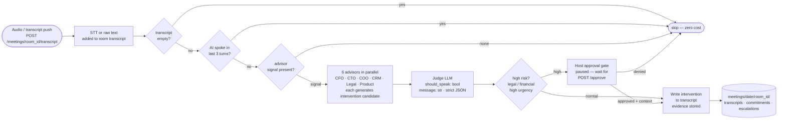

### Finance / CFO Stack — Bank Reconciliation

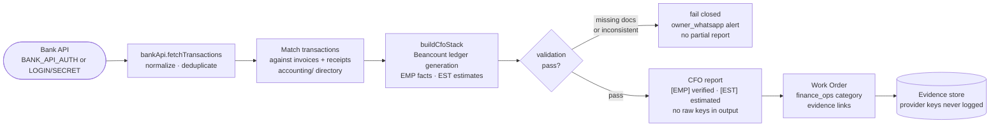

### Budget / Cost Guard — Model Plan Selection

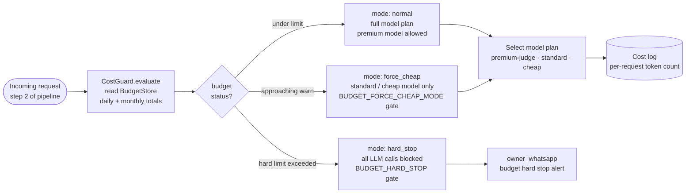

### Cron — Daily Records Refresh

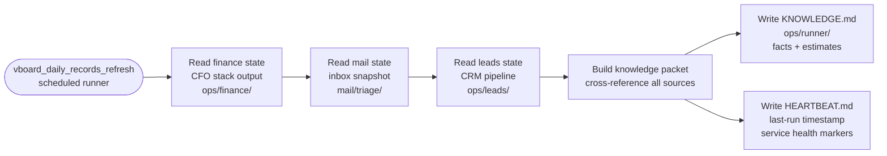

### Cron — Cost Guardrail

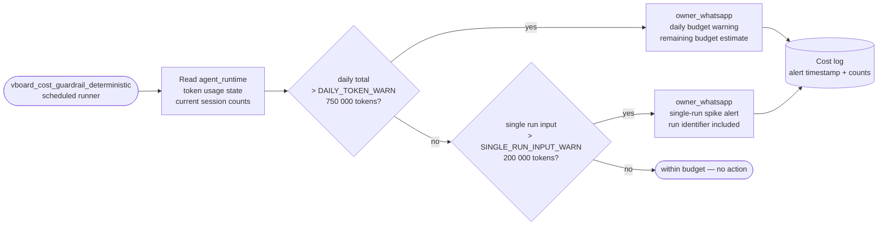

### Cron — Mail Triage Collect

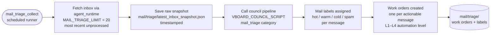

### Cron — Finance Run

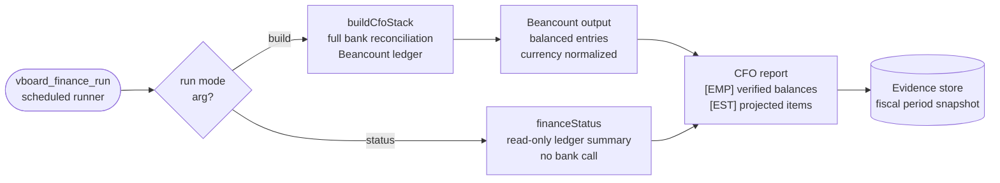

### Cron — Document Memory Refresh

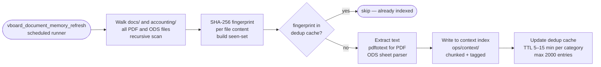

### Cron — Ops Status and Prod Doctor

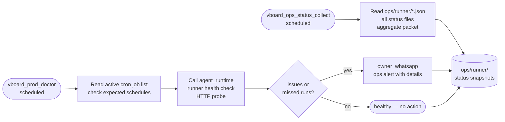

### Route Policy — Council vs Local Dispatch

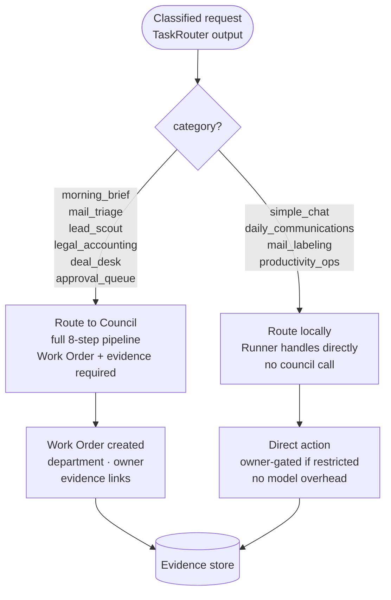

### Output Quality Gate — Council Text Validation

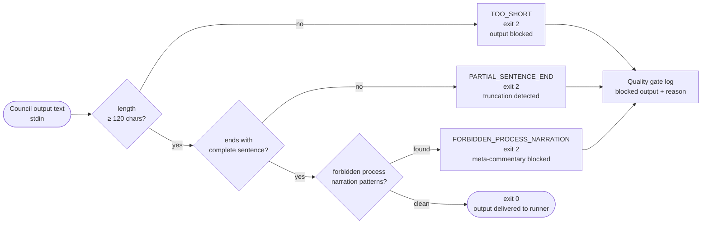

## Algorithms

V-Board is not a prompt wrapper. Each layer runs a defined algorithm before any model call is made.

### VBoardCouncilEngine - 8-Step Request Pipeline

Every POST to `/route` runs a fixed 8-step pipeline. Steps 1, 2, 3, 5, 6, and 7 are deterministic - no LLM, no variable cost.

```
Step 1  TaskRouter.classify()        Zero-cost keyword/regex category, urgency, restriction flags
Step 2  CostGuard.evaluate()         Daily/monthly budget check; selects model plan or hard-stops
Step 3  buildWorkflow()              Prospect Score (D_fast formula), mail policy, lead structuring
Step 4  applyKitchenWorkers()        Parallel mail classifier - hot / warm / cold / spam
Step 5  evaluateDealRoom()           0-100 deal score; activates deal captain at 82, owner-pass at 92
Step 6  enforceSafetyGates()         10 named gates; any trigger blocks all send/CRM actions
Step 7  buildWorkOrder()             Durable work unit with L1 Draft -> L4 Hard Block automation level
Step 8  CouncilRuntime.run()         Model call + ExecutiveJudge decision tree + evidence write
```

### Prospect Score (D_fast)

Deterministic lead qualification computed before any model call:

```
D_fast = (S x T x Psi) x Phi - (1 - E)   [normalized 0-1]

S   Structure     contact reachability    (8 if email/site/phone, else 5)
T   Timing        urgency signals         (8 if keyword match, else 6)
Psi   Upside        pain points             (5 if needs discovery, else 8)
Phi   Connectivity  sector fit              (8 for saas/agency/edu/recruiting, else 6)
E   Exposure      risk level              (5 if restricted keywords, else 9)

strong_pick (D_fast > 0.60) -> +7 deal room pts
maybe       (D_fast >= 0.30) -> +3 deal room pts
reject      (D_fast < 0.30) -> -30 deal room pts
```

### AIWorkerCollective - 5-Stage Meeting Council

Used in the meeting room when a high-stakes intervention is considered:

```
Stage 1  Primary model          role-specialist answer                   weight 1.5
Stage 2  2x Reviewers parallel  independent scoring (0-100)              weights 1.3, 1.2
Stage 3  Weighted consensus     agreement >= 0.66 required for approval
Stage 4  Chairman synthesis     invoked only when consensus fails        weight 2.0
Stage 5  Behavioral overlay     keyword pattern scan (no LLM call)
```

Reviewers score on: `relevance`, `accuracy`, `risk_assessment`, `tone`, `overall`. A reviewer approves when `overall >= 70`. The chairman synthesizes a final answer from both reviewer critiques and is only invoked when consensus fails. Three independent model families prevent bias collapse.

### Intervention Judge - Token-Efficient Guard Chain

Before any LLM fan-out, three deterministic guards short-circuit the intervention check:

```
Guard 1  transcript empty?           -> skip (no cost)
Guard 2  AI spoke in last 3 turns?   -> skip (no cost)
Guard 3  no advisor signal?          -> skip (saves all fan-out tokens)
         then, only if all pass
         6 specialty advisors in parallel (CFO, CTO, COO, CRM, Legal, Product)
         then
         single judge LLM call -> strict JSON decision
```

### Safety Gates

10 named gates enforced deterministically before and after model calls. Any triggered gate blocks all automated send and CRM actions and forces an `owner_whatsapp:notify_owner` action:

`NON_OWNER_RESTRICTED_REFUSAL` | `OWNER_ONLY_RESTRICTED_DATA` | `HOT_MAIL_OWNER_APPROVAL` | `WARM_MAIL_OWNER_APPROVAL` | `RESTRICTED_MAIL_OWNER_ONLY` | `SPAM_NO_REPLY` | `DEAL_ROOM_OWNER_REVIEW` | `COLD_REJECT_BLOCKS_AUTOSEND` | `BUDGET_FORCE_CHEAP_MODE` | `BUDGET_HARD_STOP`

### Behavioral Pattern Overlay

Runs a keyword scan over each meeting transcript. No LLM call. Currently detects 6 patterns (`urgency_inflation`, `commitment_avoidance`, `dominance_signaling`, `appeasement`, `trust_building`, `defensive_posture`). The full 572-pattern behavioral registry is the Phase 4 target.

See [`docs/ALGORITHMS.md`](docs/ALGORITHMS.md) for complete specifications with thresholds, formulas, and implementation status.

---

## Contracts That Matter

- **Route decision**: every task gets a category, urgency, temperature, ownership state, and allowed next step.
- **Work order**: every non-trivial task becomes a durable unit of work with status, owner, department, and evidence links.
- **Evidence record**: reports separate empirical facts from estimates with `[EMP]` and `[EST]` tags.
- **Council output**: council may recommend, object, and summarize, but it cannot send external messages.
- **Meeting event**: transcripts, decisions, commitments, escalations, avatar sessions, and generated audio are logged per room.
- **Provider adapter**: provider-specific secrets and SDKs stay at the adapter edge, not in the product core.

See [`docs/ARCHITECTURE.md`](docs/ARCHITECTURE.md), [`docs/CONTRACTS.md`](docs/CONTRACTS.md), [`docs/PROVIDER_ADAPTERS.md`](docs/PROVIDER_ADAPTERS.md), and [`docs/ALGORITHMS.md`](docs/ALGORITHMS.md).

## Meeting Room

The meeting room is the flagship interactive path:

1. A room is created with active advisors such as CFO, CTO, COO, Legal, Product, or CRM.
2. Human transcript or audio enters the room.
3. The advisor council checks whether intervention is useful.
4. Risky, legal, or high-urgency interventions pause for host approval.
5. Approved interventions resume with context and are written to the transcript.
6. Evidence is stored under `VBOARD_DATA_ROOT/meetings/<date>/<room_id>/`.

See [`docs/MEETING_ROOM.md`](docs/MEETING_ROOM.md).

## Provider Model

Core code is provider-neutral. Operators can wire their own:

| Capability | Generic env |
|---|---|
| Primary LLM | `PRIMARY_LLM_API_KEY`, `PRIMARY_LLM_API_BASE_URL` |
| Reviewer LLM | `REVIEWER_LLM_API_KEY`, `REVIEWER_LLM_API_BASE_URL` |
| Chair LLM | `CHAIR_LLM_API_KEY`, `CHAIR_LLM_API_BASE_URL` |
| LLM router | `LLM_ROUTER_API_KEY`, `LLM_ROUTER_API_BASE_URL` |
| Speech-to-text | `STT_API_KEY`, `STT_SDK_MODULE`, `STT_SDK_CLIENT` |
| Voice | `VOICE_API_KEY`, `VOICE_API_BASE_URL`, `VOICE_API_KEY_HEADER` |
| Avatar | `AVATAR_API_KEY`, `AVATAR_API_BASE_URL` |
| Bank data | `BANK_API_AUTH` or `BANK_API_LOGIN` / `BANK_API_SECRET` |

## Security Invariants

- Protected services require bearer tokens in production.
- Meeting-room containers bind to localhost by default.
- File reads and writes are scoped under configured data roots.
- Provider keys are never written to evidence logs.
- The council cannot send email, chat, CRM updates, payments, filings, or legal commitments.
- The CFO stack fails closed when bank validation is missing or inconsistent.
- CI scans for hardcoded secrets, phone numbers, private server IPs, and unsafe council send permissions.

See [`SECURITY.md`](SECURITY.md) and [`docs/meeting-room-security.md`](docs/meeting-room-security.md).

## Development

```bash
npm install
npm test --workspaces --if-present
npm run demo:meeting
```

Meeting-room tests:

```bash
python -m pip install -r packages/meeting-room/requirements.txt pytest
python -m pytest packages/meeting-room/tests -q
```

Syntax and guardrails used during verification:

```bash
node packages/council/scripts/check_all.js
node packages/ops-core/tests/run.js
python packages/meeting-room/scripts/check_meeting_room_security.py
```

## Status

This repository is an actively developed open-source automation framework. The architecture is stable; the gaps below are known and tracked.

### What is shipped

- Full 8-step deterministic routing pipeline (TaskRouter -> CostGuard -> WorkOrder -> CouncilRuntime)
- 10 safety gates enforced before model calls
- D_fast prospect scoring formula (zero LLM cost)
- 0-100 deal room score with six team briefs
- 5-stage AIWorkerCollective council with weighted consensus voting
- Intervention judge with 3-guard token-efficient chain
- Meeting room with transcript memory, escalation, host approval, and evidence store
- JS test suite (`packages/ops-core/tests/run.js`, `packages/council/scripts/hardening_test.js`)
- Python test suite (`packages/meeting-room/tests/`)
- GitHub Actions CI for JS, meeting-room, and deploy

### Gaps vs production-shipped quality

| Gap | Impact | Priority |
|-----|--------|----------|
| Behavioral overlay: 6 patterns implemented, 572 planned | Meeting room misses most behavioral signals | Phase 4 |
| No JSON schemas for route decision, work order, evidence contracts | Downstream consumers can't validate | High |
| No CHANGELOG.md | Integrators can't track breaking changes | High |
| No GitHub issue templates | Community contribution friction | Medium |
| No rate limiting on HTTP endpoints | DoS risk at scale | Medium |
| Dedup cache is in-process only | Does not survive restarts | Medium |
| No operator dashboard | Cost/blocked-work visibility requires log parsing | Low |
| Provider adapter examples limited to core | Integrators must read source to onboard | Low |

### Next milestones

- Stable JSON schemas for route decisions, work orders, evidence, and meeting events
- CHANGELOG.md and semantic release tags
- Issue templates and contribution guide
- Rate limiting on `/route` and meeting-room endpoints
- Behavioral pattern registry expansion (Phase 4)
- One-command Docker demo with seeded fixtures
- Operator dashboard for model usage, cost, blocked work, and evidence trails

## License

MIT. See [`LICENSE`](LICENSE).
