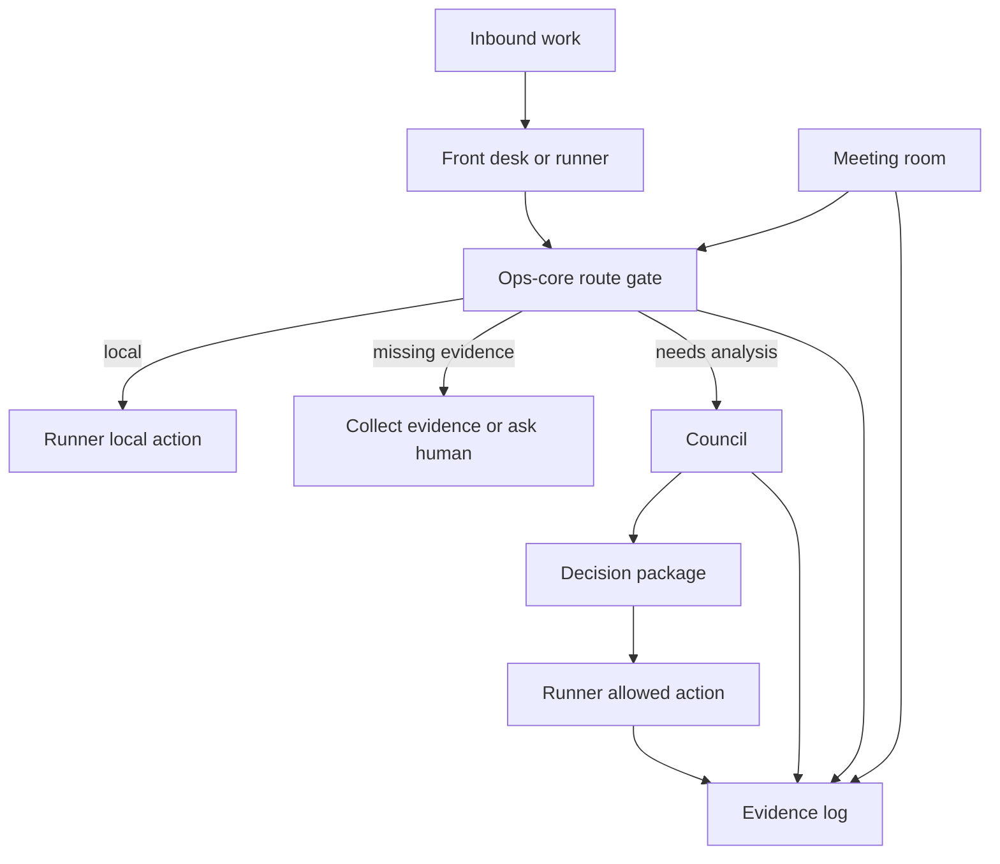

# Architecture

V-Board is an operations automation framework with five runtime surfaces.

## 1. Front Desk

The front desk is the communication boundary. It receives human requests, sends approved replies, and keeps customer-facing behavior separate from high-temperature analysis.

Typical responsibilities:

- inbound message triage
- owner notifications
- approval prompts
- CRM-safe summaries
- user-facing status reports

## 2. Ops Core

Ops core is the control plane. It decides what kind of work arrived, whether evidence is sufficient, and whether the work can stay local or needs council analysis.

Core responsibilities:

- deterministic routing
- policy enforcement
- HTTP API
- MCP tools
- scoped file access
- work orders
- finance/CFO APIs
- observability summaries

## 3. Council

Council is the specialist reasoning layer. It is composed of workers such as CFO, CTO, COO, Legal, Product, CRM, and executive judge roles.

Council responsibilities:

- deep analysis
- objections and risk review
- department-specific recommendations
- cost-aware model routing
- safety gates
- structured output

Council does not send external messages or mutate customer records directly.

## 4. Runner

Runner is the execution layer. It runs cron jobs, collects evidence, calls ops-core, renders reports, applies quality gates, and performs allowed communication.

Runner responsibilities:

- scheduled jobs
- evidence collection
- document memory refresh
- mail triage collection
- owner notifications
- report rendering
- final outbound delivery after policy checks

## 5. Meeting Room

Meeting room is the live collaboration layer. It lets AI workers join a meeting context, listen to transcripts, decide whether an intervention is useful, pause risky speech for approval, and write a durable evidence trail.

Meeting-room responsibilities:

- room registry
- transcript memory
- preflight authority policy
- intervention judge
- escalation gates
- speech-to-text adapter
- voice adapter
- avatar adapter
- transcript, decision, commitment, and escalation logs

## Request Flow

## Deployment Shapes

- Single-server Docker Compose: easiest local or VPS deployment.
- Two-server split: front desk and runner on one machine, council/back office on another.
- Meeting-room standalone: separate FastAPI service behind TLS or localhost-only reverse proxy.

## Hard Invariants

- Route before spending tokens.
- Fail closed when evidence is missing.
- Keep provider-specific code at adapter edges.
- Keep council send permissions false.
- Keep every important decision auditable.
- Keep human approval gates for legal, fiscal, payment, security, and high-risk commitments.