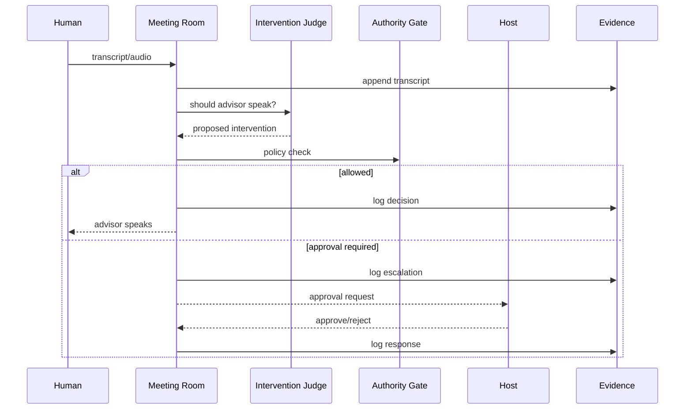

# Meeting Room

The meeting room is V-Board's flagship interactive workflow: AI workers join a meeting context, listen to humans, decide whether to intervene, and pause risky speech for approval.

## No-Key Demo

From the repo root:

```bash
python -m pip install -r packages/meeting-room/requirements.txt pytest
python packages/meeting-room/scripts/demo_meeting_room.py
```

Or with npm:

```bash
npm run demo:meeting
```

The demo runs entirely in process. It does not need real LLM, voice, STT, or avatar keys.

## Runtime Flow



## Preflight Policy

Before a meeting starts, the host can define:

- active advisors
- observe-only, host-approval, or autonomous mode
- whether workers can decide alone
- high-urgency gating
- legal gating
- token budget
- response SLA

Default mode is conservative: host approval is required for meaningful intervention.

## Evidence

Each room writes:

- `manifest.json`
- `transcript.jsonl`
- `decisions.jsonl`
- `commitments.jsonl`
- `escalations.jsonl`
- `avatars.jsonl`
- `media/`

These records are designed for legal, accounting, and operational review.

## Endpoints

| Method | Path | Purpose |
|---|---|---|
| `GET` | `/health` | Liveness probe. |
| `GET` | `/ready` | Readiness and provider configuration. |
| `GET` | `/advisors` | Public advisor list. |
| `POST` | `/meeting/join` | Register an advisor in a room. |
| `POST` | `/meeting/transcript` | Push text transcript. |
| `POST` | `/meeting/stt` | Transcribe audio through configured STT adapter. |
| `POST` | `/meeting/check` | Decide whether an advisor should intervene. |
| `POST` | `/meeting/escalation/respond` | Approve or reject a paused intervention. |
| `POST` | `/meeting/tts` | Generate advisor speech through configured voice adapter. |
| `POST` | `/meeting/avatar/provider` | Create optional avatar provider session. |
| `POST` | `/meeting/avatar/provider/echo` | Send text/audio payload to avatar echo mode. |
| `POST` | `/meeting/leave` | End room and flush memory. |

## Production Notes

- Put the service behind TLS.
- Keep `MEETING_ROOM_REQUIRE_TOKEN=true` in production.
- Bind to localhost or a private network unless a reverse proxy handles auth.
- Keep BYOK keys request-scoped and redacted.
- Use the security guard script in CI.