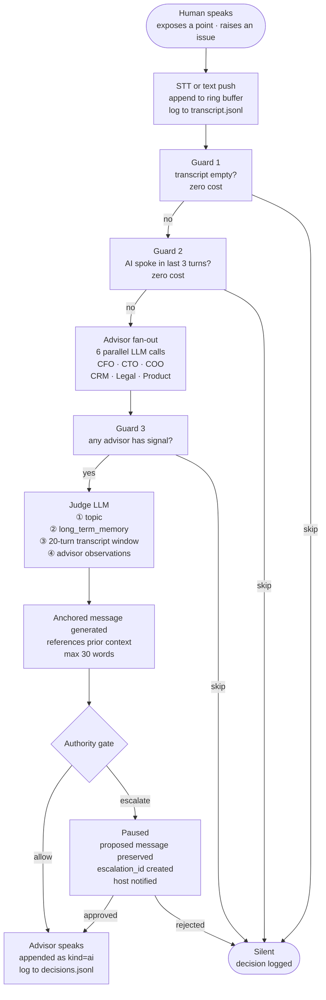
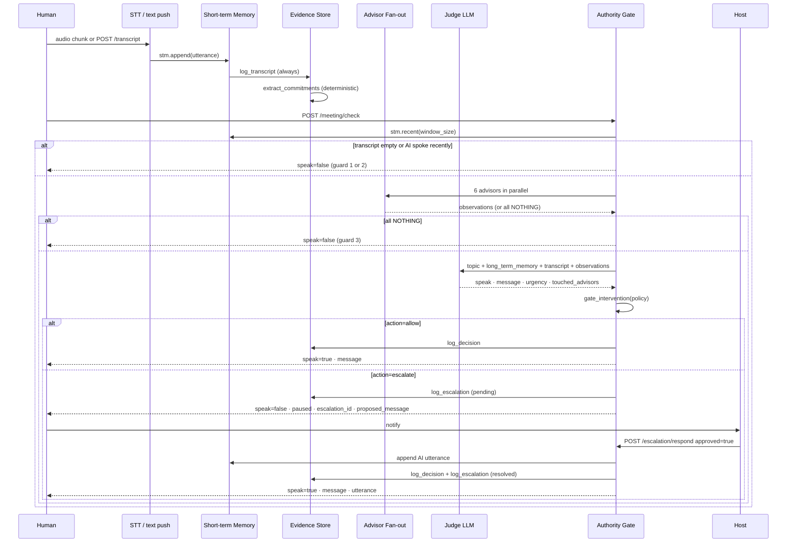

# Meeting Room — Engineering Architecture

The meeting room is V-Board's live intelligence layer: AI advisors join an active conversation, listen to every utterance, decide whether to raise their hand, and write durable evidence regardless of whether they speak. They never interrupt. They never hallucinate unsolicited. They are held to a human gate before any high-risk speech leaves the system.

---

## System Map

```
┌─────────────────────────────────────────────────────────────────────────┐
│  Meeting Room  ·  FastAPI  :8790                                        │
│                                                                          │
│  POST /meeting/join                 register room + advisor + policy     │
│  POST /meeting/transcript           append human utterance (text mode)   │
│  POST /meeting/stt                  transcribe audio chunk → append      │
│  POST /meeting/check                run intervention judge               │
│  POST /council/analyze              run full 5-stage AIWorkerCollective  │
│  POST /meeting/escalation/respond   host approves/rejects paused speech  │
│  POST /meeting/tts                  synthesize approved speech to audio  │
│  POST /meeting/avatar/provider      start avatar conversation session    │
│  GET  /meeting/status               live room registry                   │
│  GET  /health  /ready               probes                               │
└─────────────────────────────────────────────────────────────────────────┘
          │                │               │               │
          ▼                ▼               ▼               ▼
  short_term_memory   intervention.py   council/       evidence_store
  ring buffer         3-guard chain +   collective.py  JSONL files
  200 utter / 4h TTL  advisor fan-out   5-stage council per room_id
```

---

## Layer 1 — Short-Term Memory (`short_term_memory.py`)

Every utterance enters the system through the same funnel: `_append_utterance()` in the server calls `stm.append()` then immediately calls `evidence_store.log_transcript()`. Nothing is ever held in memory without being written to disk.

```
┌──────────────────────────────────────────────────────────┐
│  _RoomBuffer  (one per room_id)                          │
│                                                          │
│  buffer: deque[Utterance]   maxlen = 200                 │
│  last_activity: float       evict after 4h of silence    │
│                                                          │
│  Utterance fields:                                       │
│    id            u-{ts_ms}-{hex6}                        │
│    speaker_name  display name                            │
│    speaker_id    human-{name} or ai:{advisor_id}         │
│    text          sanitized, max 20 000 chars             │
│    kind          "human" | "ai" | "system"               │
│    ts            unix float                              │
└──────────────────────────────────────────────────────────┘
```

The buffer is an in-process deque — it does not survive restarts. Evidence JSONL files are the durable record. `stm.recent(room_id, n)` returns the oldest-first slice of the last `n` utterances, which is what the intervention judge reads.

---

## Layer 2 — Intervention Judge (`intervention.py`)

This is the core of what the anchored-response flow describes: the model listens, waits for the human to finish, then decides whether — and what — to say.

### The 3-Guard Chain (Zero-Cost Filters)

Before any LLM token is spent, three deterministic guards evaluate the buffer:

```
Guard 1  stm.recent(room_id, window_size)  →  empty?
         └─ return { speak: False, reason: "transcript_empty" }

Guard 2  any(u["kind"] == "ai" for u in window[-3:])  →  AI spoke recently?
         └─ return { speak: False, reason: "just_spoke_recently" }

         ── fan-out to advisors ──

Guard 3  observations list empty?  →  no advisor had a signal?
         └─ return { speak: False, reason: "no_advisor_signal" }

         ── judge LLM call ──
```

Guards 1 and 2 are evaluated before any network call. Guard 3 filters the advisor outputs: each advisor can return `"NOTHING TO SIGNAL"` and the guard fires if all advisors did. This is the main token saver — the judge LLM is only called when at least one specialist found something worth saying.

### Advisor Fan-Out

All active advisors run in parallel via `asyncio.gather`:

```python
results = await asyncio.gather(*[_ask_advisor(aid) for aid in active_advisors])
```

Each advisor call is a short, cheap LLM call (max 120 tokens output, temp 0.3):

```
System:  "You are the {name} advisor silently listening to an ongoing meeting.
          Produce ONE relevant observation in 1-2 sentences max.
          If nothing useful, write exactly 'NOTHING TO SIGNAL'."

User:    "Meeting topic: {topic}
          Recent transcript:
          {transcript}
          Your {name} observation:"
```

Default active advisors: `["cfo", "cto", "coo", "crm"]`. All six (`cfo`, `cto`, `coo`, `crm`, `legal`, `product`) can be activated at join time.

### The Judge LLM

If at least one advisor signals, the judge receives a single prompt combining all context layers:

```
Topic: {topic}

User long-term memory:           ← context anchor; passed by caller at check time
{long_term_memory}

Recent transcript:               ← full window (default 20 turns)
{transcript}

Advisor observations:
[CFO]  The budget discussion suggests...
[CTO]  The API dependency creates a risk...

Decide: intervene or not. Respond in strict JSON.
```

The judge's output schema is strict:

```json
{
  "speak":           true | false,
  "message":         "ONE sentence, max 30 words. Empty if speak=false.",
  "urgency":         "low" | "normal" | "high",
  "reason":          "Why (one sentence).",
  "touched_advisors": ["cfo", "cto"]
}
```

Temperature 0.2, max 280 tokens. Any JSON parse failure returns `{ speak: False, reason: "judge_parse_failed" }` — the system always fails silent rather than blurting a half-formed message.

---

## Layer 3 — Anchored Response

The anchored response is the core behavioural design of the meeting room. Instead of reacting only to the most recent utterance, the model connects what is currently being said to prior context — it "anchors" its intervention to something said earlier.

A concrete example of what gets produced:

> *"Revenant à ce que tu as dit sur le budget... tu m'as mentionné que les délais étaient serrés. Et là, quand tu dis que le scope change, je pointe ça: c'est exactement ce risque que tu as soulevé la première fois. Voici ma perspective sur comment on pourrait naviguer..."*

This behaviour is produced by two mechanisms working together.

**Mechanism 1 — Transcript window as context anchor**

The judge receives the full recent window (default 20 utterances, max 200). It sees what was said 10 turns ago alongside what was just said. The judge system prompt instructs it to only speak when something is "non-redundant" and "brings immediate value to the current conversation" — which in practice forces the message to connect the current turn to something meaningful from earlier in the window. A message that only reacts to the last turn fails the non-redundancy criterion.

**Mechanism 2 — Long-term memory injection**

The `long_term_memory` field is a free-text excerpt: who this person is, their values, prior commitments, known context from outside the room. The judge prompt places it above the transcript — making it the highest-priority anchor:

```python
if long_term_memory:
    parts.append(f"\nUser long-term memory:\n{long_term_memory}")
parts.append(f"\nRecent transcript:\n{transcript}")
parts.append(f"\nAdvisor observations:\n{obs_block}")
```

The 30-word hard limit on the judge output enforces specificity: a vague response cannot fit; a referenced, concrete point can.

**Audit — Anchor Point Records**

The diagram labels the evidence output as `transcript + anchor points + decision log`. The transcript and decision log are fully implemented. Explicit "anchor point" records — discrete structured extractions of which prior turns were referenced by a given intervention — are **not yet implemented**. The `touched_advisors` field in the judge output is the closest proxy (it lists which specialists contributed), but it does not record which utterance IDs from the transcript were referenced. Commitment extraction (deterministic rule-based, see Layer 5) produces a `commitments.jsonl` stream, but anchor references are not extracted. This is a known gap in the evidence schema.



---

## Layer 4 — Authority Gate and Escalation (`policy.py`, `escalation.py`)

Every intervention decision passes through `gate_intervention()` before the response is returned to the caller. The gate is purely deterministic — no model call.

### Preflight Policy

Set at `POST /meeting/join` time by the host:

| Field | Values | Default |
|---|---|---|
| `owner_scope` | `autonomous` / `host_approval` / `observe_only` | `host_approval` |
| `worker_can_decide_alone` | bool | `false` |
| `gate_high_urgency` | bool | `true` |
| `gate_legal` | bool | `true` |
| `requires_legal_review` | bool | `false` (auto-set if topic contains legal keywords) |
| `token_budget_usd` | float | `1.0` |
| `response_sla_ms` | int | `2000` |

If the topic contains `contract`, `legal`, `liability`, `compliance`, `gdpr`, `nda`, or `terms`, `requires_legal_review` is automatically set to `true` at preflight.

### Gate Decision Logic

```python
def gate_intervention(result, room) -> dict:
    if not result["speak"]:
        return {"action": "silent", "reason": ...}

    reasons = []
    if policy["owner_scope"] == "observe_only":
        reasons.append("observe_only")
    if policy["owner_scope"] == "host_approval" and not policy["worker_can_decide_alone"]:
        reasons.append("host_approval_required")
    if policy["requires_legal_review"]:
        reasons.append("preflight_legal_review_required")
    if policy["gate_legal"] and "legal" in touched_advisors:
        reasons.append("legal_advisor_touched")
    if policy["gate_high_urgency"] and urgency_rank(urgency) >= 3:
        reasons.append("high_urgency")

    if reasons:
        return {"action": "escalate", ...}
    return {"action": "allow", "reason": "within_worker_authority"}
```

### Escalation Flow

When `gate["action"] == "escalate"`:

```
1. escalation.create() → writes to escalations.jsonl + in-process _ESCALATIONS dict
2. Server returns:
   {
     "speak": false,                ← silenced
     "escalation_required": true,
     "paused": true,
     "escalation_id": "esc-{12hex}",
     "proposed_message": "...",     ← preserved for host review
     "resume_with_context": true,   ← full window saved in escalation.context
     "gate": { "action": "escalate", "reason": "high_urgency,legal_advisor_touched" }
   }

Host calls POST /meeting/escalation/respond:
   { "escalation_id": "...", "approved": true, "approver": "host", "note": "..." }

If approved:
   - proposed["message"] is validated and appended to STM as kind="ai"
   - evidence_store.log_decision() and log_escalation() updated
   - Response: { speak: true, message, utterance }

If rejected:
   - escalation record updated to status="rejected"
   - Response: { speak: false, message: "" }
```

---

## Layer 5 — Evidence Store (`evidence_store.py`)

Every event writes to disk. The store is append-only JSONL under:

```
$VBOARD_DATA_ROOT/meetings/YYYY-MM-DD/<room_id>/
  manifest.json          room metadata, created/updated timestamps, schema_version
  transcript.jsonl       every utterance (human + ai + system)
  decisions.jsonl        every intervention check result + council run result
  commitments.jsonl      deterministically detected commitment phrases
  escalations.jsonl      every escalation create + resolve event
  avatars.jsonl          avatar session metadata
  media/                 TTS audio files (mp3/wav/etc)
```

### Commitment Detection

The commitment extractor runs deterministically after every `_append_utterance` call. No LLM, no variable cost:

```python
markers = (
    "i will ", "i'll ", "we will ", "we'll ",
    "i can ", "we can ", "i commit ", "we commit ",
    "action item", "follow up",
)
```

Any utterance matching a marker produces a `commitments.jsonl` entry with `speaker_name`, `text`, `source_utterance_id`, `status: "open"`, and `detected_by: "rule"`.

### Security Constraints on the Store

- All paths are validated via `assert_under_root()` — any path traversal attempt raises `MeetingValidationError("path_outside_data_root", status_code=403)`.
- Provider API keys are never written to any JSONL file.
- Audio files are only written to `media/` under the room directory.
- Allowed audio suffixes are whitelisted: `.mp3 .wav .ogg .webm .m4a .bin`.

---

## Layer 6 — AIWorkerCollective (`council/collective.py`)

The `/council/analyze` endpoint runs the full 5-stage council. It is **separate** from the lightweight `check_intervention` path. Use `/meeting/check` for the per-utterance lightweight guard; use `/council/analyze` when a specific question needs full adversarial review.

```
Stage 1  Primary        w=1.5   PRIMARY_LLM_*     temp 0.3  max 600 tokens
Stage 2  Reviewer 1     w=1.3   REVIEWER_LLM_*    temp 0.2  max 300 tokens   ─┐ parallel
         Reviewer 2     w=1.2   CHAIR_LLM_*       temp 0.2  max 300 tokens   ─┘
Stage 3  Weighted vote           approve if overall ≥ 70; consensus if agree ≥ 0.66
Stage 4  Chairman       w=2.0   CHAIR_LLM_*       temp 0.2  max 600 tokens   (only if consensus fails)
Stage 5  Behavioral              keyword scan over transcript                  (no LLM)
```

Reviewer scoring dimensions: `relevance`, `accuracy`, `risk_assessment`, `tone`, `overall` (each 0–100). A reviewer approves when `overall ≥ 70`. Three separate model families (primary / reviewer / chair) prevent model-family bias collapse.

After the council run, the server appends the final output as an `"ai"` utterance to the room buffer — which means it contributes to Guard 2 of the intervention chain on the next check call.

---

## Layer 7 — Provider Adapters

### LLM Resolution Order (intervention judge)

```
1. agent.auxiliary_client.call_llm    ← respects user-configured provider via agent runtime
2. PRIMARY_LLM_SDK_MODULE / PRIMARY_LLM_SDK_CLIENT direct SDK
   requires: PRIMARY_LLM_API_KEY + PRIMARY_LLM_SDK_MODULE + PRIMARY_LLM_SDK_CLIENT
```

### LLM Resolution (AIWorkerCollective)

Three families, each using `httpx` to call an OpenAI-compatible `/chat/completions` endpoint:

| Family | Key env | Base URL env | Default price |
|---|---|---|---|
| primary | `PRIMARY_LLM_API_KEY` | `PRIMARY_LLM_API_BASE_URL` | $3 in / $15 out per M |
| reviewer | `REVIEWER_LLM_API_KEY` | `REVIEWER_LLM_API_BASE_URL` | $2.50 in / $10 out per M |
| chair | `CHAIR_LLM_API_KEY` | `CHAIR_LLM_API_BASE_URL` | $0.075 in / $0.30 out per M |

All three fall back to `LLM_ROUTER_API_KEY` / `LLM_ROUTER_API_BASE_URL` if family-specific keys are not set.

### STT / TTS / Avatar

| Adapter | Key env | Notes |
|---|---|---|
| STT | `STT_API_KEY`, `STT_SDK_MODULE`, `STT_SDK_CLIENT` | Audio base64 → text; `/meeting/stt` endpoint |
| TTS | `VOICE_API_KEY`, `VOICE_API_BASE_URL`, `VOICE_API_KEY_HEADER` | Text → audio bytes; written to `media/` |
| Avatar | `AVATAR_API_KEY`, `AVATAR_API_BASE_URL` | Video avatar conversation session |
| LiveKit | `LIVEKIT_URL`, `LIVEKIT_API_KEY`, `LIVEKIT_API_SECRET` | Real-time audio participation (Phase 2) |

---

## Full Intervention Sequence



---

## Audit: What Is Implemented vs. What Is Not

| Capability | Status | File | Notes |
|---|---|---|---|
| Ring buffer (200 utter / 4h TTL) | ✅ Shipped | `short_term_memory.py` | In-process only, does not survive restart |
| Guard chain (3 guards, zero cost) | ✅ Shipped | `intervention.py:103–120` | Exact order: empty → AI spoke → no signal |
| Advisor fan-out (parallel asyncio) | ✅ Shipped | `intervention.py:129–160` | All active_advisors in asyncio.gather |
| Judge LLM strict JSON output | ✅ Shipped | `intervention.py:165–205` | Fails silent on parse error |
| Long-term memory injection | ✅ Shipped | `intervention.py:175–179` | Caller passes string; no auto-load from file |
| Transcript window as anchor context | ✅ Shipped | `intervention.py:111,175` | window_size default 20, buffer max 200 |
| Anchored response (30-word limit) | ✅ Shipped | `_JUDGE_SYSTEM` docstring | Enforced by system prompt + max_tokens=280 |
| Authority gate (preflight policy) | ✅ Shipped | `policy.py:87–115` | 3 scopes × legal × urgency checks |
| Escalation create + resolve | ✅ Shipped | `escalation.py`, `server.py:510–536` | In-process dict, JSONL durable |
| Resume-with-context on approval | ✅ Shipped | `server.py:686–710` | Proposed message preserved, window in context |
| Evidence JSONL streams | ✅ Shipped | `evidence_store.py` | 6 streams: transcript/decisions/commitments/escalations/avatars/media |
| Commitment extraction | ✅ Shipped | `evidence_store.py:141–176` | Rule-based, zero LLM cost |
| AIWorkerCollective 5-stage | ✅ Shipped | `council/collective.py` | Primary+2 reviewers+chairman+behavioral |
| Behavioral overlay (6 patterns) | ✅ Shipped | `council/collective.py:325–344` | 6 of 572 planned patterns |
| Bearer token auth | ✅ Shipped | `server.py:80–91` | hmac.compare_digest, production enforced |
| Security headers middleware | ✅ Shipped | `server.py:94–109` | nosniff, no-frame, no-store, size limit |
| Path traversal prevention | ✅ Shipped | `security.py:96–101` | assert_under_root on all file ops |
| STT adapter | ✅ Shipped (stub) | `stt.py` | Provider-neutral; needs STT_API_KEY |
| TTS adapter + audio evidence | ✅ Shipped (stub) | `tts.py`, `evidence_store.write_audio` | Writes to media/ |
| Avatar session | ✅ Shipped (stub) | `avatar.py` | Needs AVATAR_API_KEY |
| LiveKit real-time audio | 🟡 Phase 2 stub | `livekit_agent.py` | Returns error until livekit-agents SDK wired |
| Explicit anchor point records | ❌ Gap | `evidence_store.py` | touched_advisors is proxy; no extracted utterance refs |
| Auto-load long-term memory from file | ❌ Gap | `intervention.py` | Caller must pass; no server-side persistent lookup |
| Restart-durable transcript buffer | ❌ Gap | `short_term_memory.py` | Deque is in-process; reload from JSONL not implemented |
| Behavioral registry (572 patterns) | ❌ Phase 4 | `council/collective.py:327` | 6 patterns today |
| Post-meeting summary | ❌ Phase 6 | `server.py:362` | `summary_available: false` stub |
| Rate limiting on endpoints | ❌ Gap | `server.py` | No per-IP or per-room throttle |

---

## Security Invariants

- Meeting-room containers bind to `127.0.0.1` by default (`MEETING_ROOM_HOST`).
- All protected endpoints require `Authorization: Bearer <MEETING_ROOM_API_TOKEN>`.
- In production mode (auto-detected from `ENVIRONMENT`, `RAILWAY_ENVIRONMENT_NAME`, etc.), the server refuses all protected requests without a token and disables `/docs` and `/openapi.json`.
- Provider API keys are never written to evidence files.
- Audio uploads are validated: base64 decode, size check (`MAX_AUDIO_BYTES` = 10 MB default), suffix whitelist.
- Text inputs are sanitized: max length enforced, null byte rejected, room IDs stripped of non-printable chars.
- File writes are always validated against the data root via `assert_under_root`, preventing any path traversal via room_id or filename parameters.

See [`SECURITY.md`](../SECURITY.md) and [`docs/meeting-room-security.md`](meeting-room-security.md) for the full threat model.

---

## No-Key Demo

```bash
python -m pip install -r packages/meeting-room/requirements.txt pytest
python packages/meeting-room/scripts/demo_meeting_room.py
```

Or with npm from the repo root:

```bash
npm run demo:meeting
```

The demo runs entirely in process. It does not need real LLM, voice, STT, or avatar keys. It creates a temporary meeting, adds CFO and Legal advisors, captures a transcript commitment, triggers a high-risk intervention, pauses for host approval, resumes with context, and prints the evidence directory.

## Running the Server

```bash
uvicorn adapters.meeting_room.server:app --host 127.0.0.1 --port 8790
```

Or via Docker:

```bash
docker compose up meeting-room -d
curl http://127.0.0.1:8790/health
curl http://127.0.0.1:8790/ready
```

## Endpoints

| Method | Path | Purpose |
|---|---|---|
| `GET` | `/health` | Liveness probe |
| `GET` | `/ready` | Readiness and provider configuration |
| `GET` | `/advisors` | Public advisor list |
| `POST` | `/meeting/join` | Register an advisor in a room |
| `POST` | `/meeting/transcript` | Push text transcript utterance |
| `POST` | `/meeting/stt` | Transcribe audio chunk, append to buffer |
| `POST` | `/meeting/check` | Run intervention judge (lightweight path) |
| `POST` | `/council/analyze` | Run full 5-stage AIWorkerCollective (heavyweight) |
| `POST` | `/meeting/escalation/respond` | Host approves or rejects a paused intervention |
| `POST` | `/meeting/tts` | Generate advisor speech audio |
| `POST` | `/meeting/avatar/provider` | Create avatar conversation session |
| `POST` | `/meeting/avatar/provider/echo` | Send text or audio to avatar echo mode |
| `POST` | `/meeting/preflight` | Validate policy before joining |
| `POST` | `/meeting/leave` | End room and flush memory |
| `GET` | `/meeting/status` | List active rooms |
| `GET` | `/meeting/escalations/{room_id}` | List escalations for a room |

## Production Notes

- Put the service behind TLS.
- Keep `MEETING_ROOM_REQUIRE_TOKEN=true` in production.
- Bind to localhost or a private network unless a reverse proxy handles auth.
- Keep BYOK keys request-scoped and redacted from evidence logs.
- Run the security guard script in CI: `python packages/meeting-room/scripts/check_meeting_room_security.py`.
