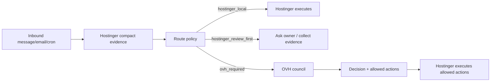

# Architecture

AZZCO Ops Core productizes the two-server operating model.

## Roles

Hostinger:

- front desk
- WhatsApp/Telegram/email communicator
- CRM writer
- data collector
- low-temperature operator
- sender/executor of explicitly allowed actions

OVH:

- high-temperature analysis
- legal/accounting/fiscal review
- CTO/security/cost/deployment review
- deal desk and quality hardening
- prepares decisions only

OVH never sends external email, WhatsApp, Telegram, or writes CRM directly.

Finance/CFO stack:

- Hostinger collects bank, invoice, receipt, and email evidence.
- The normalized context lives under `AZZCO_DATA_ROOT/ops/context`.
- The CFO stack builds reports and ledgers only from validated context.
- If validation fails, it writes a blocked report and stops; it does not invent balances.
- Owner/accountant approval remains required before filing, payment, or legal/tax action.

## Flow

## Core Contracts

- All routing goes through `classify()`.
- All bridge calls pass compact evidence.
- All write access is scoped to `AZZCO_DATA_ROOT`.
- Hot, legal, accounting, fiscal, security, incident, or commitment-risk tasks require owner approval or OVH preparation.
- Hostinger owns final delivery.
